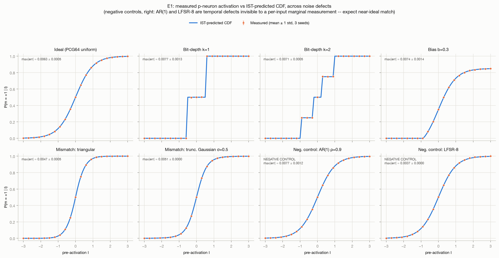
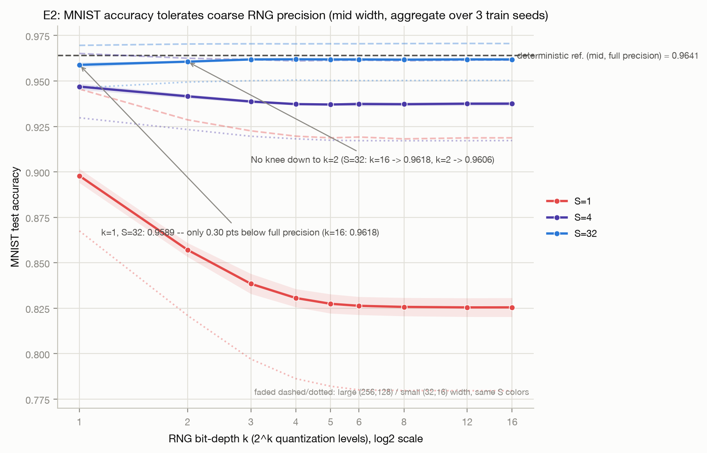
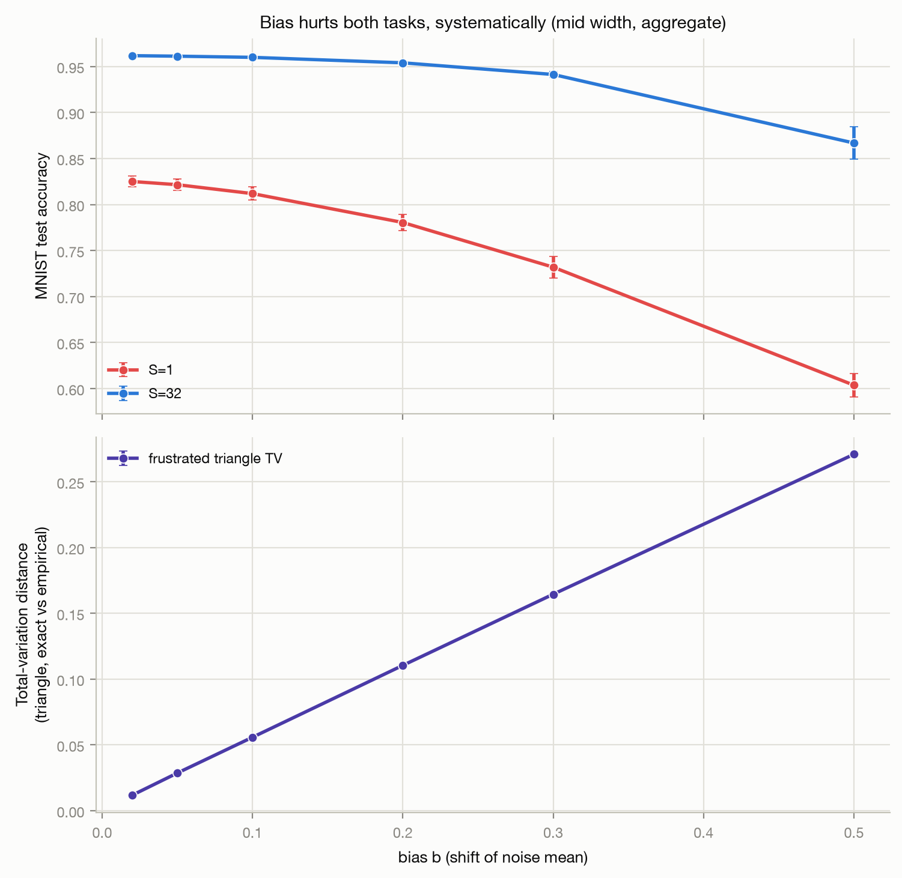
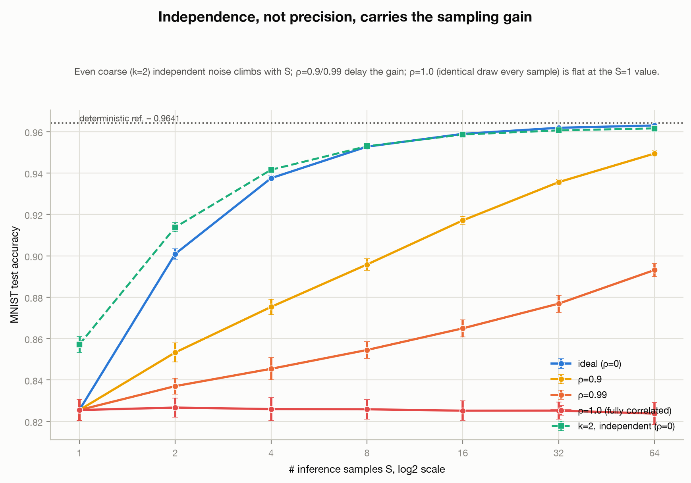
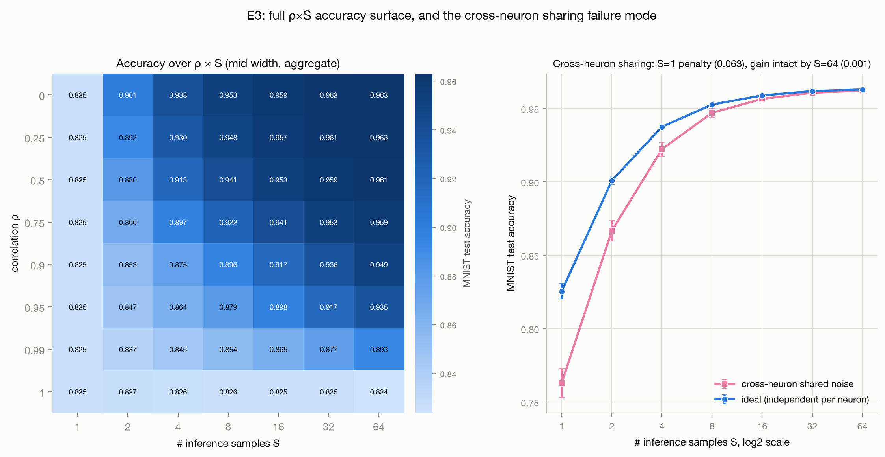
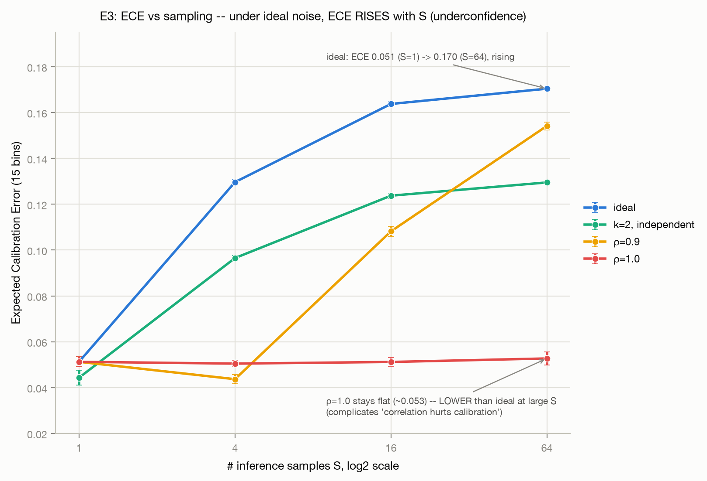
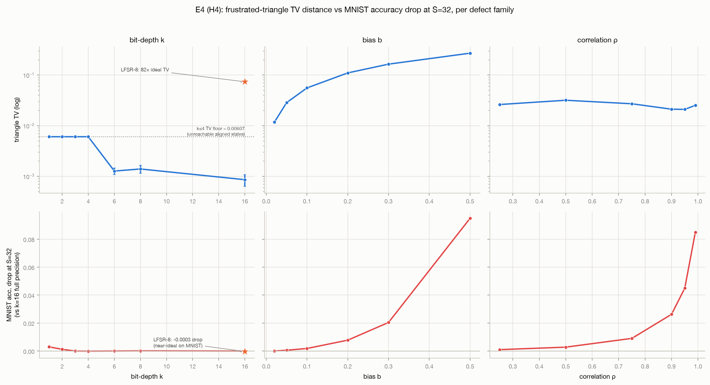
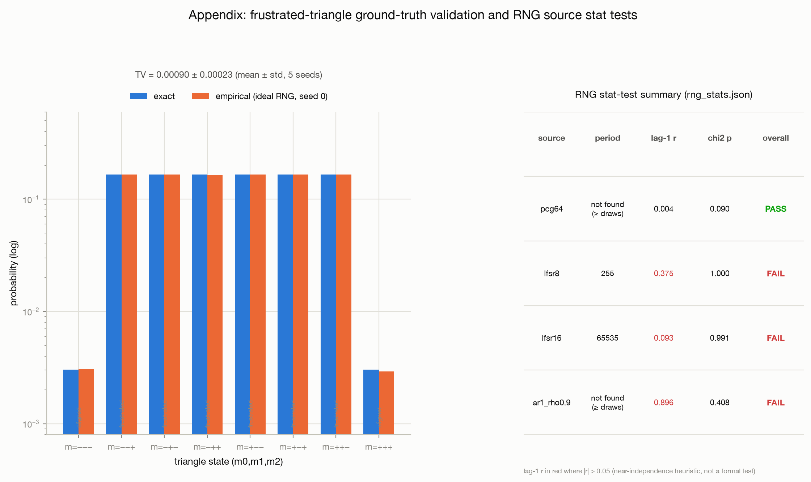
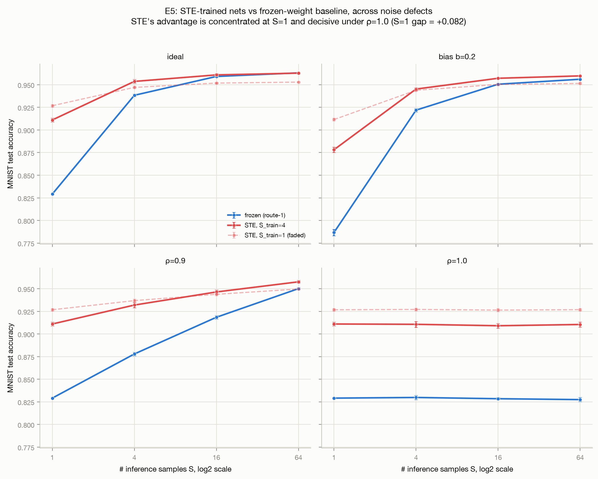

# How Good Does the Randomness Have to Be? A Reliability Study of a Feedforward p-bit Neural Network Under Degraded Randomness

## Abstract

A p-bit ("probabilistic bit") neuron fires by comparing its input against a random draw, so the *distribution* of that randomness *is* the neuron's activation function. We build a feedforward p-bit neural network (p-DNN) on MNIST by freezing a conventionally trained MLP and swapping each activation for a p-neuron at inference, then inject four families of hardware-motivated randomness defects -- reduced bit-depth, bias, correlation, and distribution mismatch -- and measure where accuracy, and especially the multi-sample accuracy benefit, degrades. The headline finding is that **precision is cheap but independence is not**: the network tolerates randomness quantized to 1-2 bits with under half a percentage point of accuracy loss at 32 samples, but the multi-sample gain is entirely erased by fully correlated noise (rho=1.0: flat 82.55% from 1 to 64 samples versus 82.55%->96.30% for ideal noise on the mid-width net) and strongly deferred by high correlation (rho=0.9 still recovers only 90% of the ideal gain by 64 samples). A 2-bit *independent* generator beats a full-precision *correlated* one (96.16% vs 94.94% at S=64). Noise-aware training with a straight-through estimator mitigates the correlation penalty (rho=1.0: ~92.7% vs ~82.8% frozen) but does not remove it, and does so by carrying its better single-sample accuracy into the regime correlation forces rather than by any defect-specific immunity. Independence across *samples*, not precision, is the binding constraint on the p-DNN sampling advantage.

## 1. Background and positioning

A p-neuron computes `m = sign(f(I) - r)`, where `f(I)` is a deterministic pre-activation (here `tanh(W.x + b)`) and `r` is a fresh random draw each forward pass. Because `m = +1` exactly when `r < f(I)`, the neuron fires with probability `CDF_r(f(I))`: the CDF of the injected noise is the activation function. This "inverse sampling theorem" (IST) is the spine of the study, and the random draw `r` at the comparator is the single injection point for every defect we test.

Two recent papers frame this work, and we are careful about what belongs to each. Bunaiyan et al. [1] (which includes our instructor and TA as coauthors) introduce the configurable p-neuron primitive and the "noise distribution = activation" idea, validated at the single-neuron and 3-neuron logic-gate level; the primitive and the configurable-activation concept come from [1], not from us. Ghantasala et al. [2] show that p-bit neurons work in *feedforward* DNNs (not only Boltzmann machines) and that averaging a few stochastic passes at inference raises accuracy; [2] is our method template, and the frozen-weight "add noise to a trained model" route we use is theirs.

Neither anchor paper studies degraded randomness -- both assume an ideal generator. **Our contribution is only the reliability-under-imperfect-randomness study**: taking the feedforward p-DNN of [2], viewing its activations through the IST lens of [1], degrading the randomness along controlled axes, and measuring the consequences against exact ground truth. We do not claim to have invented the p-DNN or configurable activations.

## 2. Methods

**Primitive and route.** The p-neuron implements the three sub-operations (activation, RNG, compare) explicitly, with the RNG a swappable seeded object so a defective generator can be substituted at the comparator. The primary route freezes a conventionally trained MLP and replaces each hidden activation with a p-neuron at inference, so any accuracy change is attributable to the randomness alone. Three network widths -- large (256,128), mid (64,32), small (32,16) -- are each trained at 3 seeds (deterministic test accuracy 97.21% / 96.41% / 95.44%). Unless noted, results are for the mid width, pooled over the 3 training seeds and 5 noise seeds. Multi-sample inference averages logits over `S` independent stochastic passes; the full 10,000-image MNIST test set is used throughout.

**Defect families.** (i) *Bit-depth* `k`: quantize `r` to `2^k` levels, swept k in {1,2,3,4,5,6,8,12,16}. (ii) *Bias* `b`: shift the mean of `r`, b in {0.02...0.5}. (iii) *Correlation* `rho`: a Gaussian-copula AR(1) source, `r_t` correlated at lag 1 with strength rho while keeping the marginal exactly Uniform[-1,1]. The copula design deliberately isolates *independence* from *activation shape* -- the marginal (hence the IST activation) is held fixed, so any effect is due to the serial correlation, not a deformed activation. rho is swept {0, 0.25, 0.5, 0.75, 0.9, 0.95, 0.99, 1.0}, plus a cross-neuron-sharing variant (same draw reused across neurons in one pass). (iv) *Distribution mismatch*: triangular / truncated-Gaussian substituted where uniform was intended. A realistic 8- and 16-bit Galois LFSR is also tested as a same-generator device-like source.

**Ground truth.** The frustrated antiferromagnetic triangle (three p-bits, `J_ij=-1`, `E=sum m_i m_j`) has a closed-form target: each of the 6 frustrated states 0.16566, each of the 2 aligned states 0.003034. With a good RNG the Gibbs sampler converges to this distribution: a 10^5-sweep pre-check measured total-variation distance TV = 0.00397 against its pass gate of TV < 0.01, and the full 10^6-sweep runs (10^4 burn-in) then gave ideal TV = 0.0009 +/- 0.0002 over 5 seeds; degrading the RNG then raises TV provably. RNG generators are stat-tested (period, lag-autocorrelation, chi-square histogram) before use: PCG64 passes all; the LFSRs and AR(1) fail autocorrelation/period as designed.

**Seeds and error bars.** MNIST conditions use 5 noise seeds and 3 training seeds; the triangle uses 5 seeds per condition. Reported bands are +/-1 std over the relevant seed pool; effect "significance" against noise-seed variance uses a 2-sigma (2x combined std) threshold. The straight-through (STE) route (E5) trains 2 seeds each at S_train in {1,4}.

## 3. Results

### 3.1 H1 -- the defects deform the activation exactly as IST predicts (supported)

For each defect we measured the single-neuron firing rate `P(m=+1 | I)` over a 61-point input grid (20,000 Monte-Carlo draws per point, 3 seeds) and compared it to the IST prediction `CDF_r(tanh(I))` computed from the defective `r`'s actual distribution.

Every measured curve matches its IST prediction to within max-absolute-error 0.0037-0.0077, all essentially at the Monte-Carlo noise floor of `sqrt(0.25/20000) = 0.0035`: triangular 0.0047, truncated-Gaussian 0.0051, ideal 0.0063, bias-0.1 0.0070, bit-depth k=2 0.0071, bias-0.3 0.0074, k=1/k=3 0.0077. The two temporal defects -- AR(1) rho=0.9 (copula) and the 8-bit LFSR -- are **negative controls**: correlation and periodicity are invisible to a per-input marginal measurement, so both are predicted (and observed, errors 0.0077 and 0.0037) to match the ideal-like CDF rather than a deformed one. A large error *there* would signal a bug, not H1 support. **Verdict: supported** -- the IST is the correct mechanistic account, and correlation/LFSR are marginal-invisible, which motivates the multi-sample experiments where their effect actually appears.

### 3.2 H2 -- the network is highly tolerant of low precision (supported, stronger than expected)

There is **no failure knee** as precision drops. On the mid net at S=32, k=1 reaches 95.89% versus 96.18% at k=16 -- a cost of only **0.29 pp** for 1-bit randomness. Accuracy is flat from k=16 down to k~2, and only the k=1->k=2 step registers at all.

A counter-intuitive effect appears at S=1: **coarser noise is better**. At S=1 on the mid net, k=1 scores 89.78%, beating k=16 (82.55%, statistically identical to the unquantized full-precision ideal, also 82.55%) by **+7.2 pp**. The anomaly detector flags exactly this as accuracy *dropping* as precision *increases* from 1 to 2 bits (e.g. 89.78%->85.71% on mid). The most plausible account is that 1-bit quantization coarsens `r` toward a two-level sign, reducing per-draw variance in the argmax at a single sample; **we flag this mechanism as an inference from the pattern, not a direct measurement** -- it is consistent with variance reduction but we did not measure the logit variance decomposition.

Bias is the one *per-draw* defect that genuinely damages the network. At b=0.5 the mid net falls to 60.4% at S=1 and recovers only to 86.7% at S=32 -- averaging cannot undo it, because a mean-shifted `r` is a *systematic* rather than zero-mean corruption of every activation. This contrasts with the zero-mean quantization defect, where S=32 stays at ~96%. **Verdict: supported** -- tolerance to precision is strong (even improving at S=1 for a mechanism we can only infer), while bias, being systematic, is the damaging per-draw defect.

### 3.3 H3 -- the multi-sample gain requires independent draws (supported, with nuance)

This is the headline. We sweep accuracy versus number of inference samples S for independent (rho=0) versus correlated noise.

The ideal sampling gain on the mid net is +13.68 pp (82.55%->96.30%, S=1->64). Correlation degrades it in a graded, not binary, way:

| rho | S=1 | S=4 | S=16 | S=64 | gain S1->S64 | % of ideal gain |
|----|------|------|------|------|-------------|-----------------|
| 0.0 (ideal) | 82.55 | 93.75 | 95.89 | 96.30 | 13.75 | 100% |
| 0.9 | 82.55 | 87.53 | 91.71 | 94.94 | 12.39 | 90% |
| 0.99 | 82.55 | 84.54 | 86.49 | 89.31 | 6.76 | 49% |
| 1.0 | 82.55 | 82.59 | 82.52 | 82.38 | -0.17 | ~0% |

The precise statement matters: **only rho=1.0 truly collapses the gain** -- it is flat within noise from S=1 to S=64 (the curves stay at the single-sample value; this flatness is confirmed inside noise tolerance). rho=0.9 does **not** collapse; it *delays*, still reaching 90% of the ideal gain by S=64, and the rho=0.9 curve is not yet saturated at S=64. But at practical sample budgets the penalty is large: at S=4, ideal 93.75% vs rho=0.9 87.53% (-6.22 pp).

The independence-over-precision contrast is direct: a **2-bit independent** generator reaches 96.16% at S=64, beating a **full-precision rho=0.9 correlated** generator at 94.94% (+1.22 pp), while the 2-bit generator costs only 0.14 pp against the full-precision ideal (96.16 vs 96.30). Two bits of independent randomness are worth more than full precision that is correlated. The effect is width-robust: at all three widths rho=1.0 is flat and rho=0.9 recovers more slowly than ideal (e.g. large net rho=1.0 stays ~91.8% across S, small net ~77.9%).

Sharing one noise draw *across neurons within a forward pass* is a **distinct failure mode**: it costs 6.2 pp at S=1 (76.3% vs 82.55% ideal) but the multi-sample gain is intact, recovering to 96.22% at S=64 (~ ideal 96.30%). So it is specifically independence **across samples** -- not across neurons -- that is load-bearing for the sampling advantage.

Calibration is an **honest complication, not a clean win** (single train seed, 5 noise seeds). Under ideal noise, expected calibration error *rises* with S (0.051 at S=1 -> 0.170 at S=64): averaging many one-hot-ish stochastic softmaxes makes the ensemble *underconfident*. Correlation, by preventing that averaging, keeps ECE flat -- rho=1.0 stays ~0.051-0.053 and ends up with *lower* measured ECE than ideal at S=64 (0.053 vs 0.170). We do **not** read this as "correlation improves calibration" or "correlation hurts calibration"; it is an artifact of the underconfidence direction and the averaging mechanism, and it flags that ECE is not a reliable stand-in for randomness quality here. **Verdict: supported with nuance** -- independence across samples governs the multi-sample gain; rho=1.0 collapses it, high rho defers it past practical budgets, cross-neuron sharing is a separate S=1 effect, and the ECE behavior is a genuine ambiguity we report rather than spin.

### 3.4 H4 -- the same defect can be benign on one task and severe on another (supported)

We apply the same defect families to the frustrated triangle, where deviations are provable via TV distance from the exact distribution, and overlay with MNIST sensitivity.

Bias produces the fastest TV growth, monotonically to 0.271 at b=0.5 (from 0.056 at b=0.1). Bit-depth shows a sharp **threshold**: for k<=4 the TV is pinned at *exactly* 0.00607 (= 0.006068), which is precisely the total exact probability mass of the two aligned states (2 x 0.003034). The mechanism is exact: at an aligned state the local field is `I=-2`, and `tanh(2)=0.9640` exceeds the top reachable quantization level 0.9375, so a coarsely quantized comparator can never leave the aligned basin -- the empirical aligned-state frequency is exactly 0, and the residual TV is the mass that should have been there. For k>=6 this unlocks and TV falls to ~0.001.

The same-generator contrast is the sharpest cross-task point: the **8-bit LFSR is statistically indistinguishable from ideal on MNIST** (96.22% at S=32 vs ideal 96.16-96.18%) yet sits at **TV=0.0739 on the triangle -- ~82x the ideal TV of 0.0009**. A generator that is "good enough" for a feedforward classifier is badly inadequate for a sampling task. On the triangle, correlation acts through a *different channel* than in the p-DNN: here rho correlates successive Gibbs *update* draws and directly corrupts the Markov chain (TV 0.021-0.032, non-monotonic, peaking near rho=0.5). The results file explicitly disclaims equivalence between this Gibbs-update correlation and the across-sample correlation of E3/H3 -- both are "correlated randomness," but they are structurally different corruption channels, and we make no claim mapping one to the other. **Verdict: supported** -- reliability thresholds are task-dependent, with the LFSR8 and bit-depth-threshold results the cleanest provable half.

### 3.5 H5 -- noise-aware training mitigates but does not remove the correlation penalty (mixed, stated honestly)

We compare the frozen route against a straight-through-estimator (STE) route that trains with the p-bit forward pass (2 train seeds each at S_train=1 and S_train=4).

The picture is defect-specific, and we report both absolute deltas and each net's degradation from its *own* clean baseline (because STE and frozen nets have different ceilings -- a baseline confound).

- **Precision defects (k1, k2): no benefit.** At S=64 the STE net is slightly *lower* absolutely (ste_S1: -0.80 pp at k=1, -0.83 pp at k=2) and the baseline-relative degradation delta is near zero. Precision is already free for the frozen net, so there is nothing to rescue.
- **Bias: modest relative benefit.** STE degrades less from its own baseline (rel-degradation delta negative throughout), though at large S the absolute delta is small or slightly negative (ste_S1 -0.46 pp at S=64; ste_S4 +0.37 pp).
- **Correlation: large benefit.** Under rho=1.0 at S=64, ste_S1 holds 92.69% vs frozen 82.75% (**+9.94 pp**), and ste_S4 91.05% vs 82.75% (+8.30 pp). Under rho=0.9 at S=16, ste_S1 94.38% vs 91.85% (+2.54 pp).

The table below gives accuracy at S=64 (mid width, pooled over 2 train x 5 noise seeds) and the ste_S1-minus-frozen absolute delta; the correlation row is where STE help is decisive.

| Condition (S=64) | frozen | ste_S1 | ste_S4 | ste_S1 - frozen |
|----|------|------|------|------|
| ideal | 96.31 | 95.29 | 96.28 | -1.02 pp |
| k=2 | 96.13 | 95.30 | 96.23 | -0.83 pp |
| bias b=0.2 | 95.60 | 95.14 | 95.97 | -0.46 pp |
| rho=0.9 | 95.01 | 94.97 | 95.76 | -0.04 pp |
| rho=1.0 | 82.75 | 92.69 | 91.05 | +9.94 pp |

The mechanism is not defect-specific immunity. STE simply has much better *single-sample* accuracy (ste_S1 ideal S=1 = 92.68% vs frozen 82.91%, +9.76 pp), and because rho=1.0 pins the network at its single-sample behavior, STE's better S=1 accuracy is what carries through. This is consistent with the observation that the STE advantage under rho=1.0 is roughly constant in S (~ +9.9 pp at every S), matching its S=1 edge -- it is not gaining robustness, it is starting higher where correlation traps it. The cost: ste_S1 pays ~1 pp of clean ceiling (ideal S=64 95.29% vs frozen 96.31%, -1.02 pp; deterministic-tanh 95.35% vs 96.40%), while ste_S4 pays essentially none (ideal S=64 delta -0.03 pp, not significant). **Verdict: mixed but honest** -- no help where precision is already free, modest relative help under bias, decisive help exactly where correlation removes the gain, via a mechanism (superior single-sample accuracy) we can attribute rather than a claimed defect immunity.

## 4. Headline claim

**A feedforward p-DNN tolerates even 1-2-bit randomness with almost no accuracy loss, but the multi-sample advantage requires independent draws: fully correlated noise (rho=1.0) erases it, high correlation (rho=0.9) defers it well past practical sample budgets, and noise-aware (STE) training mitigates but does not remove the penalty -- independence across samples, not precision, is the binding constraint.**

## 5. Limitations

- **Task and architecture scope.** MNIST only and MLP only; we deliberately did not pursue CIFAR-10 or an RBM. The multi-sample benefit and its correlation-fragility may differ on convolutional networks or harder tasks.
- **Parametric, not device, noise.** Every defect except the LFSR is a parametric model of a hardware imperfection, not a measured device noise trace. The LFSR is the one physically realizable generator we test.
- **Frozen-weight route is dominant.** Four of five experiments use add-noise-to-a-trained-model; the STE route is a limited 2-seed extension on the mid width only.
- **The correlation channel differs between tasks.** Feedforward across-sample correlation (H3) and triangle Gibbs-update correlation (H4) are distinct corruption channels; the strong H3 conclusion does not transfer mechanistically to H4, and we do not claim it does.
- **Calibration is ambiguous.** ECE rises with S even under ideal noise (underconfidence from averaging) and is *lower* under rho=1.0, so ECE cannot be used as a proxy for randomness quality here; the ECE panel is single-train-seed.
- **Single-figure effect sizes.** Effects are reported with +/-1 sigma over seeds and a 2-sigma-vs-noise-seed significance flag, but we did not run formal confidence intervals beyond that, and the S=1 "coarse-noise improvement" mechanism and the STE mechanism are inferences from the data pattern, not direct measurements.

## 6. Reproducibility

Repository layout: `pneuron/` (neuron primitive, defect library `noise.py`, generators + stat-tests `rng.py`); `groundtruth/triangle.py` (sampler, exact distribution, TV); `models/` (`net.py`, `pdnn.py` wrapper, `train_baselines.py`, `ste_train.py`); `experiments/` (`e1_activation.py`, `e2_precision.py`, `e3_sampling_fragility.py`, `e4_cross_task.py`, `e5_ste_robustness.py`, `sanity_check.py`, `make_figures.py`); results in `results/*.json`, figures in `plots/`. Every generator, training, and noise seed is logged in the corresponding JSON `_meta` block (train seeds 0-2; noise seeds 2000-2004; triangle seeds 0-4). Each hypothesis has one runner script writing one JSON; all nine figures regenerate from the JSONs via `experiments/make_figures.py`. Every number in this report is traceable to a field in `results/`.

## References

[1] S. Bunaiyan, M. Alsharif, A. S. Abdelrahman, H. ElSawy, S. S. Cheema, S. A. Fahmy, K. Y. Camsari, F. Al-Dirini. *Configurable p-Neurons Using Modular p-Bits.* arXiv:2601.18943 (2026); IEEE ISCAS 2026.

[2] L. A. Ghantasala, M.-C. Li, R. Jaiswal, B. Behin-Aein, J. Makin, S. Sen, S. Datta. *Improving deep neural network performance through sampling.* arXiv:2507.07763 (2025); npj Unconventional Computing (2026).

[3] Course text, Chapter 3 (Discrete Optimization): p-bit sampling, the frustrated-triangle example, Ising models. INT 93LS, Summer 2026 (ground-truth harness, section 2 above).
